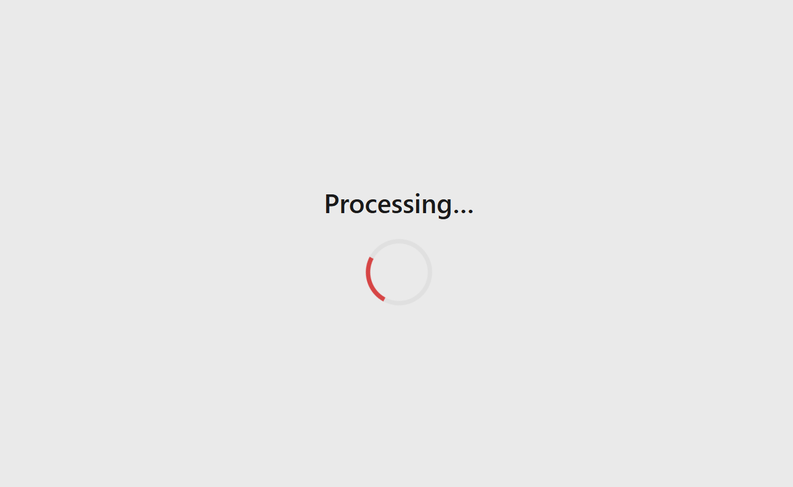

# Glaucoma Classification Demo

This project implements a multi-feature glaucoma classification pipeline using retinal fundus images. A simple web app demonstrates the core functionality: displaying the original fundus image alongside a model-generated heatmap, and integrates with the ChatGPT API for interactive analysis. 

## Demo

### Original Image and Heatmap

  
*Original fundus photograph*

  
*Glaucoma probability heatmap overlay*

### Web App Screenshots

Below are example screenshots of the web interface showcasing image upload, heatmap visualization, and ChatGPT-driven insights:

  
  
  
  
  
